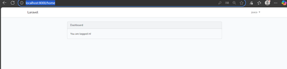

# 🔐 Implementación del Módulo de Login en Laravel

Este repositorio documenta la implementación del módulo de autenticación (Login y Registro) en Laravel, siguiendo la guía del Laboratorio de Ingeniería Web.

[](https://laravel.com)
[](https://www.php.net)
[](https://www.mysql.com)
[](https://getcomposer.org)
[](https://www.npmjs.com)

---

## 📖 Introducción y Arquitectura MVC

Este laboratorio ofrece una primera aproximación al **framework Laravel**, explorando su estructura de carpetas y su organización bajo el patrón **Modelo-Vista-Controlador (MVC)**. Laravel permite separar responsabilidades, reutilizar código y facilitar el mantenimiento de las aplicaciones.

**Objetivos del Laboratorio:**

* Identificar la estructura básica de un proyecto Laravel.
* Comprender el patrón **MVC** en el desarrollo web.
* Implementar un sistema de login y registro utilizando los paquetes de autenticación.
* Documentar paso a paso el proceso de instalación, configuración y ejecución.

---

## 🏗️ Arquitectura MVC (Modelo – Vista – Controlador)

La **arquitectura MVC** es un patrón de diseño de software que separa la aplicación en **tres componentes principales**: **Modelo**, **Vista** y **Controlador**.  
Su objetivo es **organizar el código**, mejorar la **mantenibilidad** y facilitar la **colaboración en equipo** durante el desarrollo de aplicaciones.

### 1️⃣ **Modelo (Model)**
📌 **Definición:**  
Es la capa que gestiona los **datos** y la **lógica de negocio** de la aplicación.  

🔑 **Funciones del Modelo:**
- Representar entidades (por ejemplo, un **Usuario**, **Producto**, etc.).
- Conectarse a la base de datos para **leer, escribir y actualizar información**.
- Aplicar reglas de negocio (validaciones, cálculos, restricciones).

### 2️⃣ Vista (View)**
📌 **Definición:** 
Es la capa responsable de la **interfaz** de usuario. Muestra los datos que el Controlador le envía.

🔑 **Funciones de la Vista:**
- Renderizar HTML, CSS y JS para el usuario final.
- Mostrar información de manera visual y amigable.
- No contiene lógica de negocio (solo presentación).

### 3️⃣ **Controlador (Controller)**

📌 **Definición:**
Actúa como intermediario entre el Modelo y la Vista.

🔑 Funciones del Controlador:
- Recibir solicitudes (requests) del usuario.
- Llamar a los modelos para obtener datos.
- Pasar esos datos a las vistas para mostrarlos.
- Manejar lógica de aplicación (por ejemplo, verificar si el usuario está autenticado).

---

## 🛠️ Requisitos Previos

Asegúrate de tener instalado y configurado el siguiente entorno de desarrollo:

| Herramienta / Tecnología | Versión / Descripción |
| :---------------------- | :-------------------- |
| **PHP** | 8.0 o superior |
| **Composer** | Última versión estable |
| **Laravel Installer** | `laravel new` o `composer create-project` |
| **Servidor Local** | XAMPP / WampServer / Laragon |
| **Servidor Web** | Apache o Nginx |
| **Base de Datos** | MySQL / MariaDB |
| **Editor de Código** | Visual Studio Code |
| **Node.js y NPM** | Para compilar assets |
| **Sistema Operativo** | Windows / Linux / MacOS |

---

### Instalación de Dependencias

Ejecuta los siguientes comandos tras clonar el repositorio y navegar a la carpeta raíz:

```bash
# 1. Instala las dependencias de PHP con Composer
composer install

# 2. Copia el archivo de ejemplo para crear el archivo de entorno
cp .env.example .env

# 3. Genera la clave de aplicación de Laravel
php artisan key:generate
```

## 📦 Implementación del Login
Se utilizó un scaffolding de autenticación para generar automáticamente las vistas, rutas y controladores del sistema de Login y Registro.

Flujo de instalación de autenticación utilizado:

Laravel UI (Bootstrap)

```
composer require laravel/ui
php artisan ui bootstrap --auth
npm install
npm run dev
```

## 🗄️ Base de Datos

* Entorno: MySQL / MariaDB
* Migraciones ejecutadas: php artisan migrate
* Backup generado: /database/backups/backup_login.sql

## 🏗️ Migraciones y Variables de Entorno

Configuración de variables en .env:

```
DB_DATABASE=nombre_de_tu_base
DB_USERNAME=root
DB_PASSWORD=
```

Ejecución de migraciones y comandos de configuración:

```
php artisan migrate
php artisan config:clear
php artisan config:cache
```

---

## 🧩 Dificultades y Soluciones

Dificultad 1: Versión antigua de Node.js

Solución: Se detectó que la versión de Node.js instalada era bastante antigua, lo 
que podía generar problemas con algunas dependencias de Laravel. Para 
resolverlo, se actualizó Node.js utilizando el gestor de paquetes Chocolatey, 
logrando contar con una versión más reciente y compatible. 

No se presentaron otras complicaciones relevantes durante el desarrollo del 
laboratorio. 

---

## 🖼️ Resultados Obtenidos



---

## 👨‍💻 Información del Desarrollador

Este laboratorio ha sido desarrollado por el estudiante de la Universidad Tecnológica de Panamá:

* Nombre: Joaquin Lu 
* Correo: joaquin.lu@utp.ac.pa
* Curso: Ingenieria Web
* Instructora: Ing. Irina Fong
